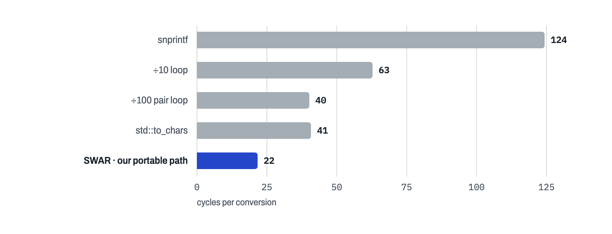
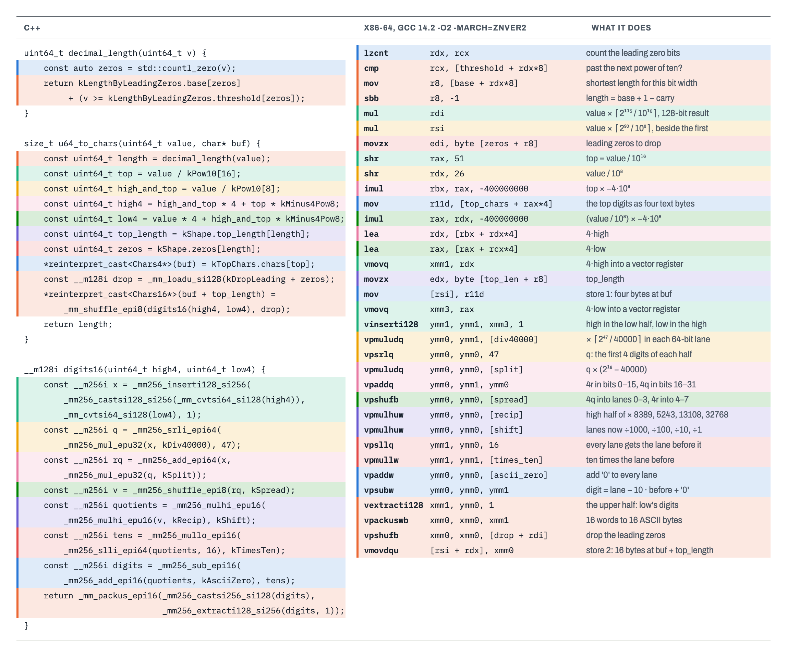

```text
8=FIX.4.4|35=8|34=4817362219|37=1727433600123456789|17=1727433600123457012|38=1500|32=300|31=1873400|151=1200|14=300|6=1873400|
```

*An execution report on the wire, SOH shown as `|`. Every highlighted value was an integer a moment ago.*

## Why printing a number is a hot path

Trading systems speak text more often than you would expect. FIX, the protocol most brokers and many venues still use for orders and fills, sends every field as `tag=value` in ASCII, separated by the SOH byte, the byte with value 1. An execution report carries about a dozen integers: quantities, prices, order and execution IDs, a sequence number, timestamps. Each of them is an integer in memory and has to become decimal text before the message can be sent.

That makes integer-to-string one of the most frequently executed functions in a trading system's order gateway. Using `snprintf` (a common C and C++ function) to convert a `uint64_t` to a string takes about 256 cycles on a modern CPU. With 10 integers per message, running at 3.1 GHz, that takes 0.8 µs. A trading system that needs to send orders as fast as possible would spend a significant amount of time only writing the quantity and price into the message.

> // Nobody goes into trading to format numbers. And yet here we are.

## What the languages give you

Every mainstream programming language has a function to convert integers to strings. They often share the same design:

```text
n = number of digits in v              # compare with 10, 100, 1000, ...
while v >= 100:                        # two digits per step, from the back
    n -= 2
    buf[n .. n+1] = PAIRS[v % 100]     # "00" "01" ... "99", a 200-byte table
    v = v / 100
write the last one or two digits
```

There is no real division in there. A 64-bit divide takes dozens of cycles, so compilers multiply by a reciprocal and shift instead (Granlund and Montgomery, 1994). This is `v / 10`:

```nasm
movabs  rax, 0xCCCCCCCCCCCCCCCD    ; 2^67 / 10, rounded up
mul     rdi                        ; 128-bit product in rdx:rax, 3-4 cycles
shr     rdx, 3                     ; drop 64 + 3 bits: v / 10
```

C++, Rust, Java, Go and .NET all use some form of this loop. C's `printf` does one digit at a time, and JavaScript stores numbers as doubles, so a 19-digit order ID doesn't even survive being a `Number`.

Faster methods exist. [jeaiii itoa](https://github.com/jeaiii/itoa) multiplies once so that 12345678 reads as the fixed-point number 12.345678, then gets each next pair by multiplying the fraction by 100. SWAR ("SIMD within a register") treats a 64-bit register as eight bytes and splits them all at once with ordinary multiplies, as [Paul Khuong](https://pvk.ca/Blog/2017/12/22/appnexus-common-framework-its-out-also-how-to-print-integers-faster/) described:


*SWAR: three splits leave one digit per byte.*

Vector registers do the same with more lanes. [Wojciech Muła's SSE2 version](http://0x80.pl/notesen/2011-10-21-sse-itoa.html) copies 1234 into four 16-bit lanes, divides them by 1000, 100, 10 and 1 at once, and subtracts ten times the neighbour to get 1, 2, 3, 4. We built on that. [Daniel Lemire's version](https://lemire.me/blog/2022/03/28/converting-integers-to-decimal-strings-faster-with-avx-512/) is faster still, but needs AVX-512.

## The naive way

```cpp
size_t naive(uint64_t v, char* buf) {
    char tmp[20];
    size_t n = 0;
    do { tmp[n++] = '0' + v % 10; v /= 10; } while (v);
    for (size_t i = 0; i < n; ++i) buf[i] = tmp[n - 1 - i];
    return n;
}
```

This method is slow because of three things.

1. **One digit per step, each waiting for the previous one.** The divide by 10 is transformed into a multiply and a shift, which takes several (about 5) cycles per iteration. A 19-digit ID takes almost 100 cycles.

2. **The loop length is unpredictable.** As the number lengths are mostly random, the CPU's branch predictor mispredicts the loop exit. That causes a pipeline stall, which costs about 20 cycles.

3. **Backwards, then copied.** The digits come out least significant first and have to be reversed.

`snprintf` runs the same loop, but first parses the format string and handles varargs, width, padding and locale, every call. The pair loop, roughly what `std::to_chars` does, halves the steps and writes in place, but still has two loops with unpredictable exits:

```cpp
size_t n = 1;
while (n < 20 && v >= kPow10[n]) ++n;                     // count the digits
for (char* p = buf + n; v >= 100; v /= 100)               // two per step
    std::memcpy(p -= 2, &kPairs[2 * (v % 100)], 2);
if (v >= 10) std::memcpy(buf, &kPairs[2 * v], 2); else buf[0] = char('0' + v);
```



*Cycles per conversion on an M2 Max, which does more per cycle than the Zen 2 (`snprintf`: 124 against 256).*

## The requirements

`size_t u64_to_chars(uint64_t value, char* buf)` writes the digits, no leading zeros, and returns the length. `buf` has 32 bytes; past the length is scratch. The target is an AMD Zen 2 with GCC 14.2. The numbers are execution report fields:


*The numbers to print, by digit count.*

Just over half have 8 digits or fewer, so any branch on the length is a coin toss. And 92.5 % fit in 16 digits, exactly one 16-byte register.

## The things to do and avoid

We don't have AVX-512 on our machine, so we stick to AVX2 and its 256-bit registers. Split the value once, convert 16 digits in parallel in vector (SIMD) lanes, and settle everything that depends on the length with table lookups and a byte shuffle at the very end. Avoid branches and loops. For a value `v`:

1. **Find the length.** Count leading zeros (`lzcnt`, `std::countl_zero`) picks an entry in a small table, and one compare adds the last digit without a branch.

2. **Two divisions, one for the top part and one to split the bottom 16 digits in half.** For 1,727,433,600,123,456,789, `v / 10^16` = 172 is the top, and `v / 10^8` = 17,274,336,001 is the top plus the high half, which leaves high = 74,336,001 and low = 23,456,789. Both start from `v`, so the CPU runs them side by side.

3. **Convert both halves at once** in one 256-bit register, with the vector method above. Shuffle packed bytes (`vpshufb`, `_mm256_shuffle_epi8`) spreads each 4-digit group over four lanes, and multiply packed unsigned words, high half (`vpmulhuw`, `_mm256_mulhi_epu16`) divides them.

4. **Drop the leading zeros** with one more byte shuffle, its mask looked up by length.

5. **Always store twice:** the top digits from a table at `buf`, then the 16 digits right after them.


*The length is worked out beside the digits and only meets them at the end.*

It has limits. Short numbers pay for 16 digits (not 19, the top is only a lookup), so if you know values stay small you can do better. It needs a buffer of at least 20 bytes, so exactly sized buffers won't work. And the tables must stay in L1; with a lot of other work in between, a method without tables may win.

## What it costs

10 cycles on the 3.1 GHz time-stamp counter is 3.2 ns, about 14 core cycles. The tables take 8.7 KB, all `constexpr` and static, and it doesn't even use the stack.

One conversion alone takes about 40 cycles. The 10 comes from overlap: our benchmark interleaves many independent calls, like a gateway writing a message, so the CPU works on three or four at once.


*40-cycle calls, 14 cycles apart: one finishes every 14 core cycles, or 10 counter ticks.*

## The journey

Our benchmark converts a million numbers from that mix, 16 at a time, timed with `rdtsc`, after a 44-million-value exactness test. The target allowed ten runs a day, so we also timed on a local Xeon VM, which turned out to be a poor stand-in.

So we leaned on [llvm-mca](https://llvm.org/docs/CommandGuide/llvm-mca.html), the LLVM Machine Code Analyzer. It doesn't run code; it simulates the assembly on LLVM's model of a CPU, which knows the execution units and latencies but not the caches or branch predictor. We marked one conversion with `asm volatile("# LLVM-MCA-BEGIN")` and `END`, compiled with the target's flags, and ran the marked part on the Zen 2 model (`-dispatch=6`, since LLVM assumes 4 µops a cycle and the Zen 2 does 6):

```bash
g++-14 -std=c++23 -O2 -march=znver2 -S -o loop.s driver.cpp
awk '/LLVM-MCA-BEGIN/{f=1} f{print} /LLVM-MCA-END/{f=0}' loop.s > one.s
llvm-mca-18 -mcpu=znver2 -iterations=1000 -dispatch=6 -timeline -all-stats one.s
```

We tried fifteen versions; these are the ones that gained something. The diffs are trimmed to the lines that matter, with the casts left out.

### 1 · SWAR, no branches (256 → 59)

The first version was SWAR. It avoids leading zeros by multiplying the value by 10^16 − length first, so the extra zeros land in the scratch bytes.

```cpp
uint64_t digits8(uint64_t x) {                  // x < 10^8 → one digit per byte
    const uint64_t q4 = (x * 109951163) >> 40;  // x / 10^4
    uint64_t w = (x << 32) - q4 * ((uint64_t{10000} << 32) - 1);
    const uint64_t q2 = ((w * 10486) >> 20) & 0x0000007F'0000007F;
    w = (w << 16) - q2 * ((uint64_t{100} << 16) - 1);
    const uint64_t q1 = ((w * 103) >> 10) & 0x000F000F'000F000F;
    return (w << 8) - q1 * ((uint64_t{10} << 8) - 1);
}
```

59 cycles. llvm-mca's resource pressure view (busy cycles per unit) showed why:

*llvm-mca · -resource-pressure (condensed)*

```text
Zn2ALU0  Zn2ALU1  Zn2ALU2  Zn2ALU3  Zn2FPU0-3  Zn2Multiplier
 20.50    25.50    20.50    20.50      -          22.00
```

All 21 multiplies queued for Zen 2's one integer multiplier, and the vector units did nothing.

> // Four ALUs and one multiplier. An office with twelve people and one coffee machine.

### 2 · Into AVX2 lanes (59 → 21)

So the digits moved to the vector units (step 3 above). The two SWAR calls became one:

```diff
-    const uint64_t high_digits = digits8(high) + kZeros;
-    const uint64_t low_digits = digits8(low) + kZeros;
-    std::memcpy(buf + top_length, &high_digits, 8);
-    std::memcpy(buf + top_length + 8, &low_digits, 8);
+    _mm_storeu_si128(buf + top_length, digits16(high, low));
```

Now the top digits stood out: 17 instructions on every conversion, for the 7.5 % of values that have any.

### 3 · Let the long ones branch (21 → 15)

A branch for the long values beat a table for their top digits. It's wrong 7.5 % of the time, but the common path shrank from 58 instructions to 40.

```diff
+    if (value >= kPow10[16]) [[unlikely]] return u64_to_chars_long(value, buf);
     const uint64_t length = decimal_length(value);
-    const uint64_t scaled = (value - top * kPow10[16]) * kPow10[16 - (length - top_length)];
+    const uint64_t scaled = value * kPow10[16 - length];
```

> // Rule one was "no branches". It lasted two versions.

### 4 · Shuffle the zeros away (15 → 14)

The model now said the dependency chain was the limit, and the chain started by waiting for the length. So we divide straight away and drop the zeros with a shuffle at the end.

```diff
-    const uint64_t high = value * kPow10[16 - length] / kPow10[8];
+    const uint64_t high = value / kPow10[8];
+    const __m128i drop = _mm_loadu_si128(kDropLeading + 16 - length);
-    _mm_storeu_si128(buf, digits16(high, low));
+    _mm_storeu_si128(buf, _mm_shuffle_epi8(digits16(high, low), drop));
```

The model promised 25 %; the target gave one cycle.

### 5 · A shorter kernel (14 → 13)

GCC's output showed a subtract and an unpack where one multiply-add would do, and our multiply by 10 turned into three shifts and an add.

```diff
-    const __m256i r = _mm256_sub_epi32(x, _mm256_mul_epu32(q, kTenThousand));
-    const __m256i qr = _mm256_unpacklo_epi16(q, r);
+    const __m256i qr = _mm256_add_epi64(x, _mm256_mul_epu32(q, kSplit));    // r and q side by side
-    ... _mm256_mullo_epi16(quotients, kTen) ...                   // GCC: three shifts and an add
+    ... _mm256_mullo_epi16(_mm256_slli_epi64(quotients, 16), kTimesTen) ...   // 1, 10, 10, 10: one multiply
```

> // The compiler "optimised" our multiply into three shifts and an add. It meant well, like a cat bringing you a mouse.

### 6 · No branch after all, and unrolled (13 → 11)

With the shuffle, the top digits had become cheap enough to drop the branch again, with a 1,845-entry table for the top and a 42-byte table for the offsets:

```diff
-    if (value >= kPow10[16]) [[unlikely]] return u64_to_chars_long(value, buf);
+    const uint64_t top = value / kPow10[16];
+    std::memcpy(buf, &kTopChars.chars[top], 4);
-    _mm_storeu_si128(buf, shuffled);
+    _mm_storeu_si128(buf + kShape.top_length[length], shuffled);
```

That was 8 % faster locally. Then we had GCC unroll the batch of 16, to get rid of the loop's own pointer steps and jump:

```diff
+target_compile_options(benchmark PRIVATE -O3
+    --param=max-completely-peeled-insns=4000 --param=max-completely-peel-times=16)
```

### Stuck at 11

11 ticks is about 15 core cycles, while no unit needed more than 8. The timeline view (`D` dispatched, `=` waiting for inputs, `e` executing, `R` retired) showed where the time went:

*llvm-mca · -timeline, first conversion, selected rows*

```text
                    0123456789          0123456789          0123456789
Index     0123456789          0123456789          0123456789

[0,0]     DeeeeER   .    .    .    .    .    .    .    .    .    .   .    movq (%r9), %r11
[0,21]    .   D===========eeeER    .    .    .    .    .    .    .   .    vmovq %rax, %xmm0
[0,25]    .    D================eeeeER  .    .    .    .    .    .   .    vpmuludq %ymm7, %ymm0, %ymm8
[0,39]    .    . D=========================================eeeeeeeeER.    vpshufb (%r15,%r13), %xmm0, %xmm0
[0,40]    .    . D=================================================eER    vmovdqu %xmm0, (%rcx,%r12)
```

The vector µops are dispatched around cycle 5 but only start at 22, and the store waits until 57, each holding a slot in the vector scheduler meanwhile. `-all-stats` showed that scheduler at 34 of 36 slots on average, stalling dispatch in 55 % of cycles. The Xeon's scheduler is three times bigger, so it never saw this.

### 7 · The factor four from the scalar side

The last cycle took three changes. First, the vector code shifted its input left by two, one more µop in the queue. The scalar side can supply the input times four for free with a `lea`:

```diff
-    const uint64_t high = high_and_top - top * kPow10[8];
+    const uint64_t high4 = high_and_top * 4 + top * kMinus4Pow8;     // imul + lea
-    const __m256i v = _mm256_shuffle_epi8(_mm256_slli_epi16(qr, 2), kSpread);
+    const __m256i v = _mm256_shuffle_epi8(qr, kSpread);             // already times four
```

### 8 · Typed stores

Modelling the whole batch showed the 16 conversions never interleaved. The stores went through `char*` and `__m128i`, which may alias anything, so GCC couldn't move the next load above them. Our own store type fixed that:

```diff
+typedef long long Chars16 __attribute__((vector_size(16), aligned(1)));
-    _mm_storeu_si128(buf + kShape.top_length[length], shuffled);
+    *reinterpret_cast<Chars16*>(buf + kShape.top_length[length]) = shuffled;
```

> // `char*` is the reply-all of pointer types. Once it writes, everyone has to assume they got the message.

### 9 · Interleave the conversions (11 → 10)

Then these flags let GCC reorder instructions before it assigns registers:

```diff
+target_compile_options(benchmark PRIVATE -fschedule-insns -fsched-pressure)
```


*The scalar parts now run among the vector tails of earlier conversions.*

The model went from 14.6 to 11.3 cycles, the Xeon saw nothing, and the target said 10.

## The final code

Thirty-four instructions and not a single jump. The colors link each line to the instructions it became.



*The final C++, its instructions in GCC's order, and what each one does.*
