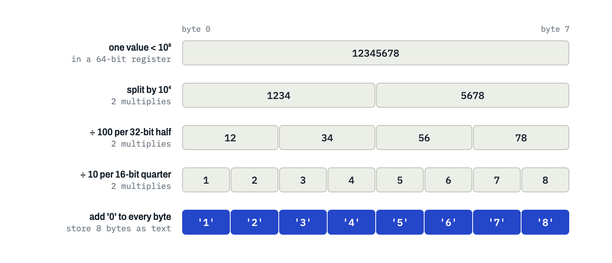
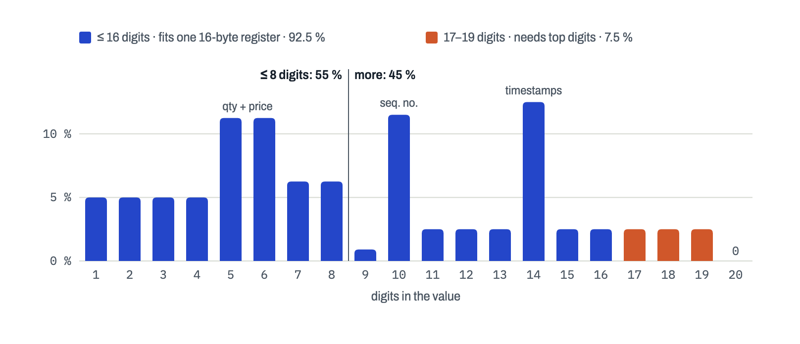
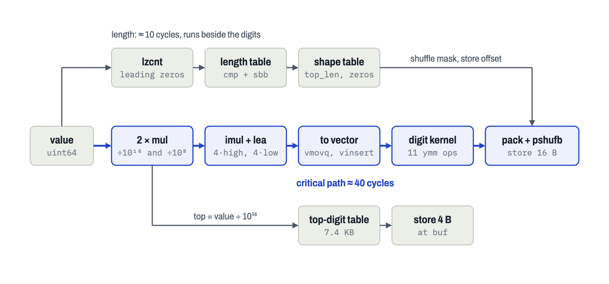
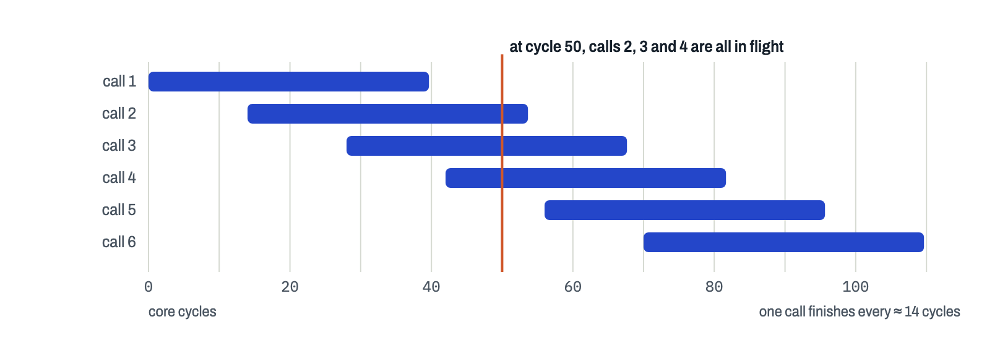
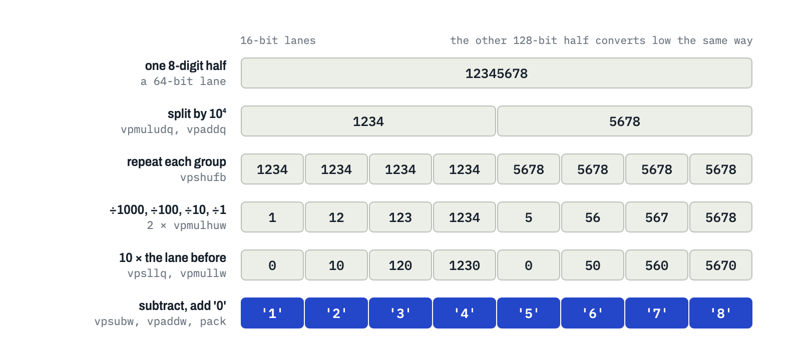
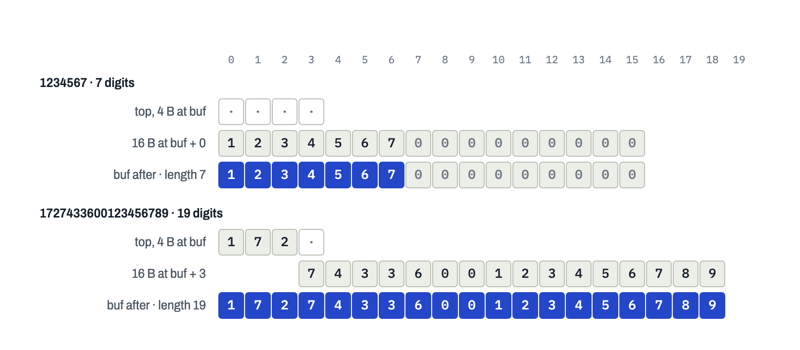
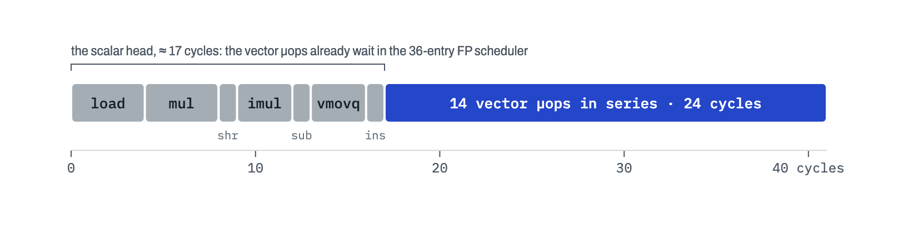
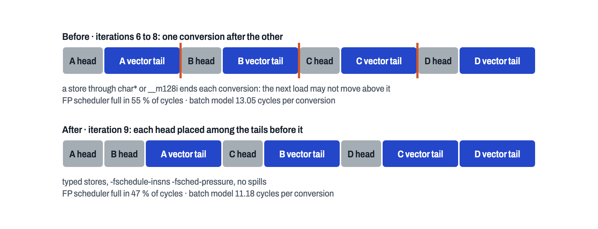

## Why printing numbers need to be fast

Trading systems speak text more often than you would expect. FIX, the protocol most brokers and many venues still use
for orders and fills, sends every field as `tag=value` in ASCII, separated by the delimiter byte, the byte with value 1. 
An execution report (a relatively large message, which is sent for almost every order update) 
carries about a dozen integers: quantities, prices, order and execution IDs, a sequence number, timestamps. 
Each of them is an integer in memory and has to be converted to text before the message can be sent.

That makes integer-to-string one of the most frequently executed functions in a trading system's order gateway. 
Using `snprintf` (a common C and C++ function) to convert a `uint64_t` to a string takes about 256 cycles on a modern CPU.
With 10 integers per message, running at 3.1 GHz, that takes 0.8 µs. A trading system that needs to send orders as fast
as possible would spend a significant amount of time only writing the quantities and prices into messages.

> // Nobody goes into trading to format numbers. And yet here we are.

```text
8=FIX.4.4|35=8|34=4817362219|37=1727433600123456789|17=1727433600123457012|38=1500|32=300|31=1873400|151=1200|14=300|6=1873400|
```
*An execution report on the wire, SOH shown as `|`. Every highlighted value was an integer a moment ago.*

## The naive way

If you or me would be asked to implement this function, we would write something like this:

```cpp
size_t naive(uint64_t v, char* buf) {
    char tmp[20];
    size_t n = 0;
    do { tmp[n++] = '0' + v % 10; v /= 10; } while (v);
    for (size_t i = 0; i < n; ++i) buf[i] = tmp[n - 1 - i];
    return n;
}
```

But this is slow because of three things:

1. **One digit per step, each waiting for the previous one.** The divide by 10 is transformed into a multiply and a
   shift, which takes several (about 5) cycles per iteration. A 19-digit ID takes almost 100 cycles.

2. **The loop length is unpredictable.** As the number lengths are mostly random, the CPU's branch predictor mispredicts
   the loop exit. That causes a pipeline stall, which costs about 20 cycles.

3. **Backwards, then copied.** The digits come out least significant first and have to be reversed.

## The standard way is better

Of course, all normal programming languages have implemented a better way than our naive implementation. They often share the same design:

```text
n = number of digits in v              # compare with 10, 100, 1000, ...
while v >= 100:                        # two digits per step, from the back
    n -= 2
    buf[n .. n+1] = PAIRS[v % 100]     # "00" "01" ... "99", a 200-byte table
    v = v / 100
write the last one or two digits
```

There is no real division in there. A 64-bit divide is relatively slow, so compilers multiply by the inverse and shift instead.

C++, Rust, Java, Go and .NET all use some form of this loop. C's `printf` does one digit at a time, and JavaScript
stores numbers as doubles, so a 19-digit order ID doesn't even survive being a `Number`.

But even faster methods exist. [jeaiii itoa](https://github.com/jeaiii/itoa) multiplies once so that 12345678 reads as the
fixed-point number 12.345678, then gets each next pair by multiplying the fraction by 100. SWAR ("SIMD within a
register") treats a 64-bit register as eight bytes and splits them all at once with ordinary multiplies,
as [Paul Khuong](https://pvk.ca/Blog/2017/12/22/appnexus-common-framework-its-out-also-how-to-print-integers-faster/)
described:



*SWAR: three splits leave one digit per byte.*

Vector registers do the same with more lanes. [Wojciech Muła's SSE2 version](http://0x80.pl/notesen/2011-10-21-sse-itoa.html) 
copies 1234 into four 16-bit lanes, divides them by 1000, 100, 10 and 1 at once, 
and subtracts ten times the neighbour to get 1, 2, 3, 4. 
[Daniel Lemire's version](https://lemire.me/blog/2022/03/28/converting-integers-to-decimal-strings-faster-with-avx-512/)
is faster still, but our machine does not support AVX-512.

## The requirements

For our implementation we first need to define the exact requirements. Which will define some tradeoffs we will make.
We will implement it in C++ and the function signature will look like this:
`size_t u64_to_chars(uint64_t value, char* buf)`;
It will write the digits, no leading zeros, and returns the length. 
`buf` has at least 32 bytes; past the length can be used as scratch. 
Our target machine is an AMD Zen 2, and we will use GCC 14.2 as a compiler.
We will benchmark our implementation with numbers that are common on execution report messages:



*The numbers to print, by digit count.*

## The strategy

We don't have AVX-512 on our machine, so we stick to AVX2 and its 256-bit registers. 
Split the value once (in a higher and lower part, because the result does not fit in a single 256-bit register). 
Convert 16 digits in parallel in vector (SIMD) lanes, and settle everything that depends on the length with table lookups and a
byte shuffle at the very end. Avoid branches and loops. For a value `v`:

1. **Find the length.** Count leading zeros (`lzcnt`, `std::countl_zero`) picks an entry in a small table, and one
   compare adds the last digit without a branch.

2. **Two divisions, one for the top part and one to split the bottom 16 digits in half.** For 1,727,433,600,123,456,789,
   `v / 10^16` = 172 is the top, and `v / 10^8` = 17,274,336,001 is the top plus the high half, which leaves high =
   74,336,001 and low = 23,456,789. Both start from `v`, so the CPU runs them side by side.

3. **Convert both halves at once** in one 256-bit register, with the vector method above. Shuffle packed bytes
   (`vpshufb`, `_mm256_shuffle_epi8`) spreads each 4-digit group over four lanes, and multiply packed unsigned words,
   high half (`vpmulhuw`, `_mm256_mulhi_epu16`) divides them.

5. **Drop the leading zeros** with one more byte shuffle, its mask looked up by length.

6. **Always store twice:** the top digits from a table at `buf`, then the 16 digits right after them.



*The length is worked out beside the digits and only meets them at the end.*

One downside of this strategy is that short numbers pay for 16 digits (not 19, the top is only a lookup), 
so if you know values stay small you can do better than this. 
It needs a buffer of at least 20 bytes, so exactly sized buffers won't work. And the tables must stay in
L1; with a lot of other work in between, a method without tables might be faster.

## What it costs

If you look at the instructions, you might conclude that this conversion takes way more than 10 cycles. 
Actually, it takes about 40. But our benchmark interleaves many independent calls,
like a gateway writing a message, so the CPU works on three or four at once.
When we measure it, it takes 10 cycles on the 3.1 GHz time-stamp counter is 3.2 ns, about 14 core cycles. 



*40-cycle calls, 14 cycles apart: one finishes every 14 core cycles, or 10 counter ticks.*

## The journey

This started as a challenge from [HFT University](https://hftuniversity.com/). Their benchmark converts a million
numbers from the mix above, 16 at a time, each into its own 32-byte slot, like the numeric fields of one message. It
reads the CPU's time-stamp counter (`rdtsc`) before and after, and divides by a million. That number, measured on their
AMD Zen 2, is the score, and you get ten tries a day.

Ten tries a day is not much, so most of the work happened on my own machine, an Intel Xeon in a virtual machine. I made
one change at a time. Every version first had to pass a test of 44 million numbers, each compared byte for byte with
`std::to_chars`, with guard bytes around the buffer to catch any write past the end. Then I timed it against the best
version so far. Timings in a VM jump around by 10 %, so the two versions ran in turns, many times over, and I compared
the medians. Only a clear winner went to the real machine.

### How a CPU spends its cycles

To follow the rest, you need a rough picture of what happens inside a modern CPU core. It doesn't run one instruction
after the other. The front end reads far ahead and splits instructions into µops, small steps like "multiply these two
registers". Up to six µops per cycle go into schedulers: waiting rooms where each µop sits until its inputs are ready.
Then it runs on an execution unit that can do that kind of work. The Zen 2 has four integer units for adds, shifts and
compares, but only one of them can multiply. Next to those are four vector units, which work on 256-bit registers that
hold many numbers at once. Finished µops leave in the original order.

So two things decide the speed. The first is the dependency chain: instructions that each need the result of the one
before can't overlap, so the longest such chain is the least time one conversion can take. The second is the busiest
resource: if one unit or one waiting room is full, everything behind it waits.

Branches are the third thing to know about. At an `if` or at the end of a loop, the CPU doesn't wait to find out which
way to go. It guesses and carries on. If the guess was wrong, it throws away everything it did since, which costs 16 to
20 cycles on the Zen 2. With a pattern in the data, the guesses are good. With random lengths, like ours, they're a
coin toss.

### A Zen 2 on my laptop

The Xeon turned out to be a poor stand-in for the Zen 2. To see what the Zen 2 would do, I used
[llvm-mca](https://llvm.org/docs/CommandGuide/llvm-mca.html), the LLVM Machine Code Analyzer. It doesn't run the code.
It takes the assembly, looks up every instruction in LLVM's description of the Zen 2 (how many µops, which units, how
many cycles until the result is ready) and plays it through a model of the pipeline a thousand times. It knows nothing
about caches or branch prediction, but my data sat in the fastest cache (L1) and most versions had no branches, so
that didn't matter much.

I put two marker comments around one conversion in a copy of the benchmark loop:

```cpp
asm volatile("# LLVM-MCA-BEGIN one");
acc += u64_to_chars(values[j + k], out + k * 32);
asm volatile("# LLVM-MCA-END one");
```

Then I compiled it to assembly with the target's compiler and flags, cut out the marked part, and ran it on the Zen 2
model:

```bash
g++-14 -std=c++23 -O2 -march=znver2 -S -o loop.s driver.cpp
awk '/LLVM-MCA-BEGIN/{f=1} f{print} /LLVM-MCA-END/{f=0}' loop.s > one.s
llvm-mca-18 -mcpu=znver2 -iterations=1000 -dispatch=6 -timeline -all-stats one.s
```

`-mcpu=znver2` picks the Zen 2. `-dispatch=6` is needed because LLVM's model sends 4 µops per cycle to the schedulers
and the real Zen 2 sends 6. The output starts with a summary (cycles and instructions per conversion), followed by
views of how busy each unit was, how long each instruction waited, and how full the waiting rooms were. I'll show them
where they told me something.

I kept a log of every attempt. The ones that didn't help are left out of this post. In the code below I also left out
the casts the intrinsics need, to keep it readable, and the `k...` names are constant vectors.

### Version 1 · SWAR, no branches (59 cycles)

The chart of lengths told me one thing before I wrote any code: a branch on the length would be wrong about half the
time, at 20 cycles per wrong guess. So the first version had no branches at all. It used SWAR in plain 64-bit
arithmetic.

`digits8` turns a number below 10^8 into eight digits in one register, one per byte. Take 12345678. The first line
divides by 10^4 with a multiply and a shift (109951163 is 2^40 / 10^4, rounded up), which gives 1234. The second line
puts that quotient in the low 32 bits of the register and the remainder, 5678, in the high 32 bits. The next two lines
do the same with 100 in both halves at once, which gives 12, 34, 56 and 78 in four 16-bit pieces, and the last two
lines split those by 10. Now every byte holds one digit, and adding `0x30` (the character `'0'`) to every byte makes
them ASCII. The first digit ends up in the lowest byte, which is where the first character goes when the register is
written to memory.

```cpp
uint64_t digits8(uint64_t x) {
    const uint64_t q4 = (x * 109951163) >> 40;                        // x / 10^4
    uint64_t w = (x << 32) - q4 * ((uint64_t{10000} << 32) - 1);       // quotient low, remainder high
    const uint64_t q2 = ((w * 10486) >> 20) & 0x0000007F'0000007F;    // both halves / 100
    w = (w << 16) - q2 * ((uint64_t{100} << 16) - 1);
    const uint64_t q1 = ((w * 103) >> 10) & 0x000F000F'000F000F;      // all four quarters / 10
    return (w << 8) - q1 * ((uint64_t{10} << 8) - 1);
}

size_t u64_to_chars(uint64_t value, char* buf) {
    const uint64_t length = decimal_length(value);                    // leading zero count + table
    const uint64_t top = value / kPow10[16];                          // the digits above the bottom 16
    const uint64_t top_length = length > 16 ? length - 16 : 0;
    const uint64_t below = (value - top * kPow10[16]) * kPow10[16 - (length - top_length)];
    const uint64_t high = below / kPow10[8];
    const uint64_t low = below - high * kPow10[8];
    const uint32_t top_digits = digits4(top * kPow10[4 - top_length]) + 0x30303030;
    const uint64_t high_digits = digits8(high) + 0x30303030'30303030;
    const uint64_t low_digits = digits8(low) + 0x30303030'30303030;
    std::memcpy(buf, &top_digits, 4);
    std::memcpy(buf + top_length, &high_digits, 8);
    std::memcpy(buf + top_length + 8, &low_digits, 8);
    return length;
}
```

`u64_to_chars` splits the number into the top (whatever is above the bottom 16 digits, at most 4 digits) and the 16
below it, which it converts as two halves of 8. The trick is in the `below` line. Instead of removing leading zeros
afterwards, it multiplies the number by 10^(16 − length) first. 1234567 becomes 1234567000000000: the digits start at
the front, and the zeros that creates end up after the length, in bytes we're allowed to scribble on.

On the Zen 2 this took 59 cycles, down from 256 for `snprintf`. llvm-mca said 35 cycles and 92 instructions per
conversion. Its resource pressure view, which shows how many cycles per conversion each unit is busy, showed the
problem:

*llvm-mca · -resource-pressure (condensed)*

```text
Zn2ALU0  Zn2ALU1  Zn2ALU2  Zn2ALU3  Zn2FPU0-3  Zn2Multiplier
 20.50    25.50    20.50    20.50      -          22.00
```

Look at the last column. The one integer unit that can multiply was busy 22 of the 35 cycles, because all 21
multiplies had to go through it. The four vector units, `Zn2FPU0` to `Zn2FPU3`, show a dash. They did nothing at all.

> // Four ALUs and one multiplier. An office with twelve people and one coffee machine.

### Version 2 · Into AVX2 lanes (21 cycles)

So the digit work had to move to the idle vector units. An AVX2 register is 256 bits wide, sixteen 16-bit lanes, and
one instruction does the same thing to every lane. `digits16` converts both 8-digit halves in one register, `high` in
the lower 128 bits and `low` in the upper 128 bits:

```cpp
__m128i digits16(uint64_t high, uint64_t low) {
    const __m256i x = _mm256_inserti128_si256(_mm256_castsi128_si256(_mm_cvtsi64_si128(high)),
                                              _mm_cvtsi64_si128(low), 1);
    const __m256i q = _mm256_srli_epi64(_mm256_mul_epu32(x, kDiv10000), 45);    // x / 10^4:    1234
    const __m256i r = _mm256_sub_epi32(x, _mm256_mul_epu32(q, kTenThousand));  // x % 10^4:    5678
    const __m256i qr = _mm256_slli_epi16(_mm256_unpacklo_epi16(q, r), 2);      // side by side, times 4
    const __m256i v = _mm256_shuffle_epi8(qr, kSpread);                        // each in four lanes
    const __m256i quotients = _mm256_mulhi_epu16(_mm256_mulhi_epu16(v, kRecip), kShift);  // 1, 12, 123, 1234
    const __m256i digits = _mm256_sub_epi16(quotients,
        _mm256_slli_epi64(_mm256_mullo_epi16(quotients, kTen), 16));          // minus 10 × the lane before
    const __m128i bytes = _mm_packus_epi16(_mm256_castsi256_si128(digits),
                                           _mm256_extracti128_si256(digits, 1));  // 16 lanes to 16 bytes
    return _mm_or_si128(bytes, _mm_set1_epi8('0'));
}
```

In each half it divides by 10^4 to get two groups of four digits, 1234 and 5678, and copies each group into four
lanes. Then it divides the four copies by 1000, 100, 10 and 1 at the same time. There's no vector divide, so it
multiplies each lane by a constant close to 2^23 / 1000 (or / 100, / 10) and keeps only the high 16 bits of the
product. A second multiply-high by a power of two shifts away the bits that are left, because the lanes can't each
shift by a different amount. The factor four from the line before keeps this exact for the lane that is divided by 1.
That leaves 1, 12, 123 and 1234. Ten times the lane to the left is 0, 10, 120 and 1230, and
subtracting gives 1, 2, 3, 4. The last step packs the sixteen 16-bit lanes into 16 bytes.



*One half of the register, step by step (without the factor four, to keep the numbers readable).*

In `u64_to_chars`, the two SWAR conversions and their stores became one call and one 16-byte store:

```diff
     const uint32_t top_digits = digits4(top * kPow10[4 - top_length]) + 0x30303030;
-    const uint64_t high_digits = digits8(high) + 0x30303030'30303030;
-    const uint64_t low_digits = digits8(low) + 0x30303030'30303030;
     std::memcpy(buf, &top_digits, 4);
-    std::memcpy(buf + top_length, &high_digits, 8);
-    std::memcpy(buf + top_length + 8, &low_digits, 8);
+    _mm_storeu_si128(buf + top_length, digits16(high, low));
     return length;
```

That brought it to 21 cycles, and the multiplier was now busy 10 cycles instead of 22. What stood out next was the
top. Every conversion spent 17 instructions and 4 of the 7 remaining multiplies on the digits above 16, and only 7.5 %
of the numbers have any.

### Version 3 · Let the long ones branch (15 cycles)

I tried two ways to stop every number paying for the top digits. One looked the top digits up in a 4 KB table and
stayed branchless. The other sent numbers with 17 or more digits to a separate function, with a branch. On the Xeon,
the table measured 12.4 cycles and the branch 11.2.

```diff
 size_t u64_to_chars(uint64_t value, char* buf) {
+    if (value >= kPow10[16]) [[unlikely]]
+        return u64_to_chars_long(value, buf);                // 17 to 20 digits: the old code
     const uint64_t length = decimal_length(value);
-    const uint64_t top = value / kPow10[16];
-    const uint64_t top_length = length > 16 ? length - 16 : 0;
-    const uint64_t below = (value - top * kPow10[16]) * kPow10[16 - (length - top_length)];
+    const uint64_t below = value * kPow10[16 - length];
     const uint64_t high = below / kPow10[8];
     const uint64_t low = below - high * kPow10[8];
-    const uint32_t top_digits = digits4(top * kPow10[4 - top_length]) + 0x30303030;
-    std::memcpy(buf, &top_digits, 4);
-    _mm_storeu_si128(buf + top_length, digits16(high, low));
+    _mm_storeu_si128(buf, digits16(high, low));
     return length;
 }
```

This branch is a good bet for the CPU, unlike a branch on 8 digits. It guesses "short" and is right 92.5 % of the
time. The wrong guesses cost about 20 cycles × 7.5 %, so 1.5 cycles per conversion on average, while the common path
shrank from 58 instructions to 40. On the Zen 2 it went from 21 to 15 cycles.

> // Rule one was "no branches". It lasted two versions.

### Version 4 · Shuffle the zeros away (14 cycles)

Now llvm-mca said no unit was the limit any more. The limit was the dependency chain, and that chain started with the
length. Before the real work could begin, the CPU had to count the leading zeros, look up two table entries, compare,
and multiply by 10^(16 − length). Only then could the division by 10^8 start, and everything after it. That was about
10 cycles of waiting at the very start of every conversion.

So I stopped needing the length until the end. Now the value is divided right away, and the 16 digits come out with
their leading zeros: 1234567 becomes `0000000001234567`. Then a byte shuffle moves the digits to the front. `pshufb`
builds a new register by picking bytes from the old one, following a mask. A mask that starts with 9, 10, 11, … moves
byte 9 to position 0 and throws away the nine zeros. All the masks come from one 32-byte table holding 0, 1, 2, … 31,
loaded at offset 16 − length.

```diff
 size_t u64_to_chars(uint64_t value, char* buf) {
     if (value >= kPow10[16]) [[unlikely]]
         return u64_to_chars_long(value, buf);
     const uint64_t length = decimal_length(value);
-    const uint64_t below = value * kPow10[16 - length];
-    const uint64_t high = below / kPow10[8];
-    const uint64_t low = below - high * kPow10[8];
-    _mm_storeu_si128(buf, digits16(high, low));
+    const uint64_t high = value / kPow10[8];
+    const uint64_t low = value - high * kPow10[8];
+    const __m128i drop = _mm_loadu_si128(kDropLeading + 16 - length);     // 16 - length, 17 - length, ...
+    _mm_storeu_si128(buf, _mm_shuffle_epi8(digits16(high, low), drop));
     return length;
 }
```

The length is now worked out next to the digits and only joins them at the shuffle. The model promised 25 %, the Zen 2
gave one cycle. That taught me the model overrates a shorter chain. The real CPU was already hiding part of that wait
by working on the next conversions in the meantime.

### Version 5 · A shorter kernel (13 cycles)

Every vector instruction takes a seat in a waiting room and a slot on a unit, so next I read the assembly GCC made of
`digits16`, line by line, looking for anything between the two halves and the final store that didn't need to be
there. I found three things.

The remainder. `x − q × 10000` is a multiply and a subtract, and then an unpack instruction had to put `q` and `r` next
to each other for the shuffle. Adding instead of subtracting, `x + q × (2^32 − 10^4)`, gives the same remainder in the
low 32 bits with `q` sitting in the 32 bits above it, because x = 10000 × q + r. It's one multiply and one add, and the
two numbers are already side by side, so the unpack goes.

The times ten. I had written `mullo(quotients, 10)`, a multiply of every lane by 10. GCC helpfully replaced it with
shifts and an add, which is more instructions than the one multiply. When the constant isn't the same in every lane,
GCC can't do that. So now I first shift every lane one place along, then multiply by 1, 10, 10, 10. The 1 is for the
first lane of each group, which has no neighbour and only holds the zero the shift brought in.

The `'0'`. The OR with `'0'` came after the pack, as the very last step, which made the chain one step longer. Adding
`'0'` to the quotients earlier does the same while the multiply is still running.

```diff
 __m128i digits16(uint64_t high, uint64_t low) {
     const __m256i x = _mm256_inserti128_si256(_mm256_castsi128_si256(_mm_cvtsi64_si128(high)),
                                               _mm_cvtsi64_si128(low), 1);
     const __m256i q = _mm256_srli_epi64(_mm256_mul_epu32(x, kDiv10000), 45);
-    const __m256i r = _mm256_sub_epi32(x, _mm256_mul_epu32(q, kTenThousand));
-    const __m256i qr = _mm256_slli_epi16(_mm256_unpacklo_epi16(q, r), 2);
+    const __m256i qr = _mm256_slli_epi16(_mm256_add_epi64(x, _mm256_mul_epu32(q, kSplit)), 2);  // 2^32 - 10^4
     const __m256i v = _mm256_shuffle_epi8(qr, kSpread);
     const __m256i quotients = _mm256_mulhi_epu16(_mm256_mulhi_epu16(v, kRecip), kShift);
-    const __m256i digits = _mm256_sub_epi16(quotients,
-        _mm256_slli_epi64(_mm256_mullo_epi16(quotients, kTen), 16));
-    const __m128i bytes = _mm_packus_epi16(_mm256_castsi256_si128(digits),
-                                           _mm256_extracti128_si256(digits, 1));
-    return _mm_or_si128(bytes, _mm_set1_epi8('0'));
+    const __m256i tens = _mm256_mullo_epi16(_mm256_slli_epi64(quotients, 16), kOneTenTenTen);
+    const __m256i digits = _mm256_sub_epi16(_mm256_add_epi16(quotients, _mm256_set1_epi16('0')), tens);
+    return _mm_packus_epi16(_mm256_castsi256_si128(digits), _mm256_extracti128_si256(digits, 1));
 }
```

40 instructions became 37, and the Zen 2 gave 13 cycles.

> // The compiler "optimised" my multiply into three shifts and an add. It meant well, like a cat bringing you a mouse.

### Version 6 · No branch after all, and unrolled (11 cycles)

The branch from version 3 was there because the top digits used to be expensive. After version 4 they weren't. The top,
value / 10^16, is at most 1844 for a 64-bit number, so a table with the characters of all 1845 possible tops fits in
7.4 KB. And value / 10^16 and value / 10^8 can be computed side by side, because both start from the value itself.

So the branch went again. The code now always does two stores: the four bytes of top characters at `buf`, then the 16
digits right after them, at `buf + top_length`. For a number without a top, `top_length` is 0 and the second store
simply overwrites the first.



*Both stores happen for every number. Without a top, the 16 digits land on top of it.*

My first try at this was 23 % slower than the branch. It worked out `top_length` and the number of zeros to drop with
compares and conditional moves: eight instructions that did no digit work at all. A 42-byte table, indexed by length,
gives both numbers with two loads:

```diff
 size_t u64_to_chars(uint64_t value, char* buf) {
-    if (value >= kPow10[16]) [[unlikely]]
-        return u64_to_chars_long(value, buf);
     const uint64_t length = decimal_length(value);
-    const uint64_t high = value / kPow10[8];
-    const uint64_t low = value - high * kPow10[8];
-    const __m128i drop = _mm_loadu_si128(kDropLeading + 16 - length);
-    _mm_storeu_si128(buf, _mm_shuffle_epi8(digits16(high, low), drop));
+    const uint64_t top = value / kPow10[16];                    // 0 to 1844
+    const uint64_t high_and_top = value / kPow10[8];            // runs beside the line above
+    const uint64_t high = high_and_top - top * kPow10[8];
+    const uint64_t low = value - high_and_top * kPow10[8];
+    std::memcpy(buf, &kTopChars[top], 4);                       // "172" plus a zero byte, or four zeros
+    const __m128i drop = _mm_loadu_si128(kDropLeading + kShape.zeros[length]);
+    _mm_storeu_si128(buf + kShape.top_length[length], _mm_shuffle_epi8(digits16(high, low), drop));
     return length;
 }
```

That was 8 % faster than the branch on the Xeon. Now the benchmark's own loop had become a noticeable part of the work.
For every conversion it steps two pointers, compares a counter and jumps back: four instructions that do no conversion
work.
Unrolling means the compiler writes the loop body out 16 times with fixed offsets, so all of that disappears. GCC
wouldn't do it for a body this size, not even at `-O3`, until I raised two of its limits:

```diff
 target_compile_options(benchmark PRIVATE -march=native)
+target_compile_options(benchmark PRIVATE -O3
+    --param=max-completely-peeled-insns=4000 --param=max-completely-peel-times=16)
```

Together that made 11 cycles on the Zen 2.

> // I asked GCC nicely to unroll the loop. It declined. I asked again with `--param=max-completely-peel-times=16`, and it complied.

### Stuck at 11

At 11 the obvious ideas ran out, and the Xeon stopped being useful: every change I tried next measured as noise there.
So I went back to llvm-mca and added up what each unit needed per conversion. None of them needed more than 8 core
cycles. 11 ticks of the time-stamp counter is about 15 core cycles, because the core runs faster than the counter. So
where did the rest go?

The timeline view answers that. Each row is an instruction and each column a cycle. `D` means dispatched into a
scheduler, `=` waiting there for its inputs, `e` executing, `E` done, `-` waiting for older instructions to finish, and
`R` retired. These are a few rows from the first conversion:

*llvm-mca · -timeline, first conversion, selected rows*

```text
                    0123456789          0123456789          0123456789
Index     0123456789          0123456789          0123456789

[0,0]     DeeeeER   .    .    .    .    .    .    .    .    .    .   .    movq (%r9), %r11
[0,21]    .   D===========eeeER    .    .    .    .    .    .    .   .    vmovq %rax, %xmm0
[0,25]    .    D================eeeeER  .    .    .    .    .    .   .    vpmuludq %ymm7, %ymm0, %ymm8
[0,39]    .    . D=========================================eeeeeeeeER.    vpshufb (%r15,%r13), %xmm0, %xmm0
[0,40]    .    . D=================================================eER    vmovdqu %xmm0, (%rcx,%r12)
```

The vector instructions are dispatched early, around cycle 5, because the front end hands out µops in order as fast as
it can. But their input, the two halves, only comes out of the scalar multiplies around cycle 20. So the first vector
multiply (`vpmuludq`) starts in cycle 22 and the final store (`vmovdqu`) in cycle 57. All that time, each of the 14
vector µops of this conversion holds a seat in the vector scheduler (AMD calls it the FP scheduler), and the Zen 2
has only 36 of those seats.



*One conversion after version 6: 17 cycles of scalar work before the 14 vector steps can even start.*

`-all-stats` confirmed it. On average 34 of the 36 seats were taken, and in 55 % of all cycles the front end couldn't
hand out anything, because that scheduler was full. That also blocked the scalar work of the next conversion, which
would have gone to the integer schedulers, and those were nearly empty. The Xeon's vector scheduler is about three
times bigger, which is why it never showed any of this.

So to get to 10, I needed fewer vector µops, and vector µops that arrive in the waiting room closer to the moment their
inputs are ready.

> // Nobody in the kitchen is busy, and yet the food is late. The waiting area is full of orders whose ingredients haven't arrived.

### Version 7 · The factor four from the scalar side

The last cycle took three changes, and I sent them to the Zen 2 together. The first removes one vector µop. `digits16`
multiplied its input by four with a shift (`slli` in the `qr` line), because the divide trick needs those two extra
bits. The scalar side can deliver four times `high` and `low` for free. The instruction that normally computes
addresses, `lea`, can calculate a + b × 4 in one go. So instead of `high = high_and_top − top × 10^8`, I compute four
times that as `high_and_top × 4 + top × (−4 × 10^8)`. Written as a subtraction, GCC moves the four into a separate
shift again, which is why the code adds a negative constant. The vector side then divides by 40,000 instead of 10,000.

```diff
+    constexpr uint64_t kMinus4Pow8 = 0 - 4 * kPow10[8];
     const uint64_t top = value / kPow10[16];
     const uint64_t high_and_top = value / kPow10[8];
-    const uint64_t high = high_and_top - top * kPow10[8];
-    const uint64_t low = value - high_and_top * kPow10[8];
+    const uint64_t high4 = high_and_top * 4 + top * kMinus4Pow8;       // imul + lea
+    const uint64_t low4 = value * 4 + high_and_top * kMinus4Pow8;      // imul + lea
     ...
-    const __m256i q = _mm256_srli_epi64(_mm256_mul_epu32(x, kDiv10000), 45);
-    const __m256i qr = _mm256_slli_epi16(_mm256_add_epi64(x, _mm256_mul_epu32(q, kSplit)), 2);
+    const __m256i q = _mm256_srli_epi64(_mm256_mul_epu32(x, kDiv10000), 47);      // 4x / 40000
+    const __m256i qr = _mm256_add_epi64(x, _mm256_mul_epu32(q, kSplit4));         // 2^18 - 40000
```

The model said 10 % faster. The Xeon said 1 to 3 %.

### Version 8 · Typed stores

Next I ran llvm-mca on the whole batch of 16 conversions, as GCC had unrolled it, to see how they overlapped. They
didn't. GCC had put them strictly one after the other: the next conversion's load of its number always came after the
previous conversion's stores.

The reason is a C++ rule. A write through a `char*` is allowed to change any object in memory, and `__m128i` has the
same exception. So after storing the digits, GCC had to assume the store might have changed the next input number,
and it wasn't allowed to load that number any earlier. Storing through types of my own, which C++ knows can't point at
a `uint64_t`, takes that worry away:

```diff
+typedef long long Chars16 __attribute__((vector_size(16), aligned(1)));   // can't alias a uint64_t
+typedef uint32_t Chars4 __attribute__((aligned(1)));
     ...
-    std::memcpy(buf, &kTopChars[top], 4);
+    *reinterpret_cast<Chars4*>(buf) = kTopChars[top];
     const __m128i drop = _mm_loadu_si128(kDropLeading + kShape.zeros[length]);
-    _mm_storeu_si128(buf + kShape.top_length[length], _mm_shuffle_epi8(digits16(high4, low4), drop));
+    *reinterpret_cast<Chars16*>(buf + kShape.top_length[length]) =
+        std::bit_cast<Chars16>(_mm_shuffle_epi8(digits16(high4, low4), drop));
```

On its own this changed little, 3 % in the model, but the next step needed it. One trap on the way: clang ignores
`aligned(1)` if you write it as a `using` alias instead of a `typedef`. It then assumes the buffer is aligned, and
crashes when it isn't.

> // `char*` is the reply-all of pointer types. Once it writes, everyone has to assume they got the message.

### Version 9 · Interleave the conversions (10 cycles)

Compilers reorder instructions to help the CPU. On x86, GCC normally does that only after it has assigned registers,
and by then the conversions are tied together, because they reuse the same registers. These two flags turn on
reordering before register allocation, and make it keep an eye on how many registers it needs. Running out means
saving values to the stack and loading them back, which costs more than it saves.

```diff
 target_compile_options(benchmark PRIVATE -O3
     --param=max-completely-peeled-insns=4000 --param=max-completely-peel-times=16)
+target_compile_options(benchmark PRIVATE -fschedule-insns -fsched-pressure)
```



*Before, each conversion starts after the previous one's stores. After, the scalar part of the next conversion runs
among the vector instructions of the ones before it.*

Now the scalar work of the next conversion runs while the vector work of the previous one is still going. Its vector
µops arrive in the waiting room when their inputs are almost ready, and sit there for less time. In the model, the
scheduler-full stalls went from 55 % to 45 % of cycles, and a conversion from 14.6 to 11.3 cycles. The Xeon measured
nothing, same as for versions 7 and 8. I sent all three to the Zen 2 anyway, and it came back with 10.

## The final code

Thirty-four instructions and not a single jump. The colors link each line to the instructions it became; hover over a
line or an instruction to see its partners.



*The final C++, its instructions in GCC's order, and what each one does.*
